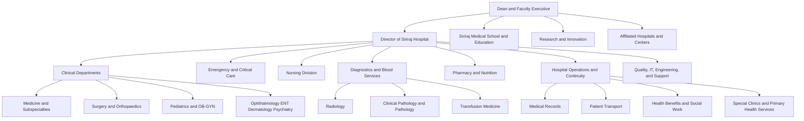
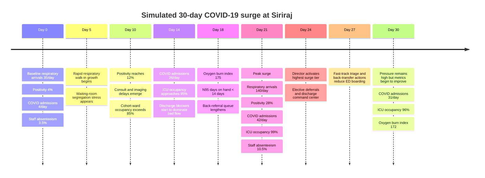
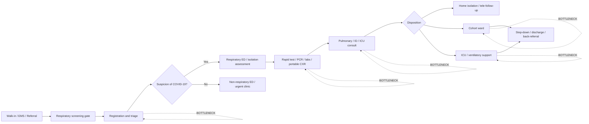
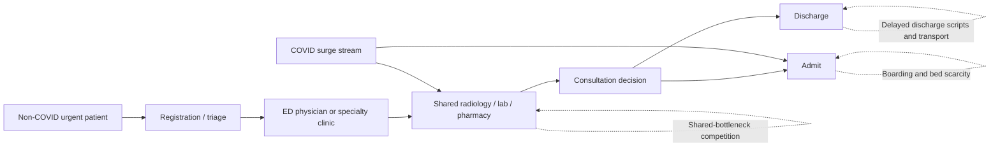
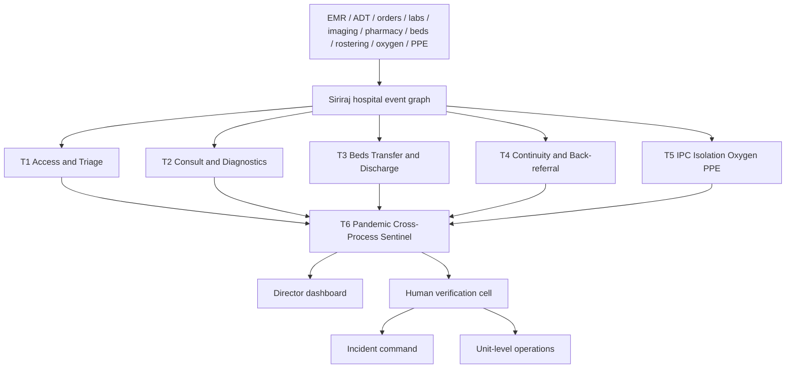

# Siriraj Hospital and a Simulated Agentic-AI COVID-19 Surge Response

## Executive Summary

entity["organization","Siriraj Hospital","Bangkok, Thailand"] is best understood as the main public hospital of entity["organization","Faculty of Medicine Siriraj Hospital, Mahidol University","Bangkok, Thailand"], a university-hospital and academic medical-center tier institution within entity["country","Thailand","Southeast Asia"]. Official Siriraj materials describe the faculty-hospital complex as the country’s “Medical Institute of the Nation,” with three core missions—education, medical service, and research—and an official faculty PDF states that it delivers **super-tertiary care**. Thailand’s national health-system review treats **university hospitals** as a distinct category from regional/general hospitals and reports **21 university hospitals** nationwide, which is the tier into which Siriraj fits. Official Siriraj pages also describe it as a major referral hub receiving difficult and complicated cases from across Thailand. citeturn2view0turn29view0turn30view0turn20view1

Siriraj’s public-facing numerical profile is large but not perfectly uniform across official publications. The English Facts and Figures page lists **2,054 beds** in a main key-fact widget, while a separate official Siriraj PDF reports **2,226 beds**, **70,476 inpatients/year**, and **2,527,611 outpatients/year**; the same English facts page also reports faculty-scale volumes of **4,914,138 outpatients/year** and **115,014 inpatients/year** in another widget. Because the sources clearly differ by publication scope or year, the safest conclusion is that Siriraj is an approximately **2,000+ bed super-tertiary academic hospital**, with exact denominator depending on whether one is counting the main public hospital only or a wider faculty-hospital complex. For the simulation below, I use **2,054 active beds** as the operational denominator for the main Siriraj campus and treat the other figures as scale anchors rather than interchangeable exact values. citeturn19view0turn29view0

For a future pandemic, the most useful Agentic-AI role at Siriraj is not autonomous diagnosis; it is **whole-hospital process surveillance** across access and triage, consultation and diagnostics, bed management and discharge, continuity and back-referral, infection prevention, and cross-process anomaly detection. That is technically plausible at Siriraj because a published Siriraj COVID-19 outcomes study explicitly describes extracting data from the electronic medical record in collaboration with the Siriraj Informatics and Data Innovation Center (SiData+), while WHO guidance emphasizes triage, patient-flow organization, oxygen backup, and early monitoring of hospitalizations and hospital capacity. citeturn25view0turn24search1turn24search5turn24search18

## Siriraj Institutional Profile

Siriraj opened in 1888, and the official history page states that Thailand’s first medical school was established there in the same year. The faculty’s official mission page defines Siriraj’s identity as “The Medical Institute of the Nation” and assigns it three integrated missions: education and training, tertiary clinical service, and research and innovation. An official Siriraj PDF further describes the faculty as the **first and largest medical school** in Thailand and an autonomous governmental non-profit organization affiliated with entity["organization","Mahidol University","Thailand"]. citeturn20view0turn2view0turn29view0

| Profile item | Concise statement |
|---|---|
| Hospital type | University hospital; super-tertiary academic referral center |
| Institutional role in Thailand | National referral hub for difficult/complex cases; medical-school hospital in the university-hospital tier |
| Institutional identity | Main public hospital of the Faculty of Medicine Siriraj Hospital, Mahidol University |
| Founding and heritage | Officially opened in 1888; site of Thailand’s first medical school |
| Mission | Education and training, tertiary clinical service, research and innovation |
| Bed size | Official public sources vary: 2,054 beds on the English facts page; 2,226 beds in an official faculty PDF |
| Teaching role | Undergraduate, postgraduate, residency, and fellowship training |
| Research role | Official faculty PDF reports 900+ peer-reviewed publications per year |
| Current executive anchors | Dean of the faculty and a separately identified Director of Siriraj Hospital are listed on the official administrative page |
| Referral role | Receives patients with difficult diseases and complex conditions from throughout Thailand |

The table above synthesizes official Siriraj pages for history, mission, administrative leadership, and department listings, together with the national health-system review’s classification of university hospitals as a distinct care tier. citeturn20view0turn2view0turn21view0turn29view0turn30view0

| Functional cluster | Representative official units or departments explicitly listed by Siriraj |
|---|---|
| Executive and hospital leadership | Dean; Director of Siriraj Hospital; Deputy Deans; Director of Siriraj Medical School |
| Core adult medical services | Medicine and its subspecialties; Emergency Medicine; Preventive & Social Medicine |
| Core surgical services | Surgery and surgical divisions; Orthopaedic Surgery; Anesthesiology |
| Women and children | Pediatrics; Obstetrics & Gynecology; Child and Adolescent Psychiatry |
| High-volume specialty ambulatory services | Ophthalmology; Otorhinolaryngology; Dermatology; Psychiatry |
| Diagnostics and blood services | Radiology; Clinical Pathology; Pathology; Transfusion Medicine |
| Nursing and inpatient operations | Nursing division and specialty nursing lines for OPD, surgery, medicine, OB-GYN, pediatrics, radiology, primary care, and more |
| Pharmacy and nutrition | Pharmacy division; Nutrition division |
| Hospital operations and continuity | Medical records, patient transport, health benefits/insurance rights, social work, special clinics, primary-health services |
| Special centers | Her Majesty Cardiac Center, Siriraj Cancer Center, stroke center, diabetes center, emergency medical service center, transplant services, and multiple centers of excellence |
| Academic and research infrastructure | Research department, clinical research center, medical education technology center, Siriraj Medical School, affiliated schools |
| Support infrastructure | Engineering, medical-gas systems, IT, quality development, risk management, security, procurement, and facilities |

This functional department map is a deliberately concise operational synthesis of Siriraj’s official structure page, department-and-centers page, and administrative page rather than a verbatim legal organogram. citeturn10view0turn11view0turn9view0turn21view0

The mermaid chart below is therefore best read as an **operational org chart for hospital-process monitoring**, not as a replacement for Siriraj’s full official organization chart.



## Simulation Assumptions and Surge Timeline

The simulation below is intentionally explicit about what is **assumed** versus what is **historically anchored**. Public official sources describe Siriraj’s institutional scale and mission but do not expose real-time ICU telemetry, oxygen-system capacity, current negative-pressure-room counts, or live rosters. Those missing inputs are therefore modeled assumptions. Historical anchors come primarily from published Siriraj COVID-19 studies showing that, among 2,430 hospitalized COVID-19 patients from January 2020 to December 2021, **13% required ICU care**, overall in-hospital mortality was **9.4%**, most patients were admitted in the late-2020 to 2021 wave, and the highest mortality coincided with the highest admission period. A separate Thai/Siriraj study found that **ROX index ≤ 5.1** and a predictive model score ≥ 8 were useful thresholds for oxygen-therapy failure and need for invasive mechanical ventilation. citeturn25view0turn26search14

| Parameter | Baseline assumption | Peak-surge assumption | Notes |
|---|---|---|---|
| Main-campus bed denominator | 2,054 active beds | unchanged | Chosen from official facts page as the simulation denominator |
| Total staffed-bed occupancy | 85% | 97% on day 21 | Assumption |
| Staffed critical-care beds | 160 | expandable to 184 via surge conversion | Assumption; not an official disclosed figure |
| Respiratory/PUI ED arrivals | 35/day | 140/day on day 21 | Assumption |
| SARS-CoV-2 test positivity in respiratory stream | 4% | 28% on day 21 | Assumption |
| Daily COVID admissions | 4/day | 42/day on day 21 | Assumption, chosen to fit Siriraj scale and historical stress plausibly |
| ICU need among COVID admissions | 14% | 14% | Anchored conservatively to Siriraj’s historical 13% ICU rate |
| Oxygen-supported COVID census | 26 | 168 on day 21 | Assumption |
| Oxygen burn index | 100/day | 188/day on day 21 | **Normalized index**; 100 = baseline hospital oxygen demand |
| Acute-care staff absenteeism | 3.5% | 10.5% on day 21 | Assumption |
| N95 days on hand | 26 days | 11 days on day 21 | Assumption |
| Median registration-to-triage | 18 min | 46 min on day 21 | Assumption used to drive T1 |
| Median consult-to-completion in respiratory ED cohort | 52 min | 128 min on day 21 | Assumption used to drive T2 |
| Admission-decision-to-bed | 94 min | 312 min on day 21 | Assumption used to drive T3 |

Two explicit modeling choices matter. First, **oxygen burn** is represented as a normalized operational index rather than a claimed real Siriraj cubic-meter value, because public sources reviewed here do not disclose current oxygen telemetry. Second, **critical-care capacity** is modeled operationally rather than asserted as public fact, because Siriraj’s public pages do not expose a definitive live ICU-bed denominator. Historical anchors are limited to the published Siriraj COVID cohort and the oxygen-failure study. citeturn25view0turn26search14



## Surge Patient Flow and Sub-Agent Results

Published Siriraj COVID-19 data show that admitted COVID-19 patients were managed in **cohort wards and ICUs with modified airborne infection isolation rooms**, and that Siriraj extracted historical data from its EMR in collaboration with **SiData+**. That makes a whole-hospital monitoring architecture conceptually credible: data exist, COVID-specific care pathways existed, and patient outcomes were already analyzable across wards, ICU, respiratory support, and complications. WHO operational guidance similarly emphasizes rapid identification, masking, separation of suspected cases, organized inpatient management, and capacity monitoring. citeturn25view0turn24search1turn24search7





The next diagram shows the **agentic command loop** assumed in this simulation. It is a hospital-operations design pattern, not a claim that Siriraj has already deployed it in reality.



All JSON outputs below are **simulated day-21 peak outputs** generated from the assumption table above. They are not real Siriraj telemetry.

**T1 — Access-and-Triage Sentinel**

```json
{
  "agent": "T1 Access-and-Triage Sentinel",
  "simulation_day": 21,
  "time_window": "08:00-16:00",
  "alert_level": "red",
  "confidence": 0.92,
  "metrics": {
    "median_registration_to_triage_min": 46,
    "baseline_registration_to_triage_min": 18,
    "respiratory_arrivals_per_day": 140,
    "respiratory_waiting_area_utilization_pct": 138,
    "segregation_breaches_count": 7,
    "left_before_triage_pct": 4.1,
    "critical_wait_over_10min_count": 6
  },
  "threshold_breaches": [
    "Median registration-to-triage > 45 min and > 1.5x baseline",
    "Respiratory waiting area utilization > 120%",
    "Documented co-mingling of suspected infectious and non-respiratory patients"
  ],
  "suspected_causes": [
    "Arrival surge exceeded front-end staffing",
    "Rapid-test station throughput lagged arrivals",
    "Medical-record verification formed a secondary queue"
  ],
  "recommended_human_checks": [
    "Verify timestamp integrity at registration and triage",
    "Physically inspect segregation zones",
    "Confirm active staffing at respiratory screening gate"
  ],
  "escalation": [
    "ED head",
    "OPD nursing lead",
    "IPC lead",
    "Director of Siriraj Hospital"
  ],
  "data_quality_warnings": [
    "3.2% of triage timestamps entered > 5 min late"
  ]
}
```

> **Director alert — T1.** Respiratory arrivals are now overwhelming front-end access: median registration-to-triage has increased from 18 to 46 minutes, respiratory waiting-area utilization has reached 138%, and seven segregation breaches were detected in the current peak window. Immediate human review should verify whether the primary bottleneck is still at access/triage or has shifted downstream to testing and consult capacity.  
> **Mandatory director recheck warning:** This alert was generated automatically for operational surveillance and is not a final clinical, legal, ethical, or administrative determination. Before any irreversible action, please recheck the underlying patient list, timestamps, source-system integrity, and frontline context with the responsible clinical and operational leads. Use this alert as decision support, not as a substitute for accountable human judgment.

**T2 — Consultation-and-Diagnostics Sentinel**

```json
{
  "agent": "T2 Consultation-and-Diagnostics Sentinel",
  "simulation_day": 21,
  "time_window": "08:00-16:00",
  "alert_level": "red",
  "confidence": 0.9,
  "metrics": {
    "median_consult_to_completion_min": 128,
    "baseline_consult_to_completion_min": 52,
    "portable_cxr_turnaround_min": 92,
    "baseline_portable_cxr_turnaround_min": 38,
    "ct_chest_turnaround_min": 176,
    "baseline_ct_chest_turnaround_min": 64,
    "antiviral_pharmacy_verification_min": 54,
    "baseline_antiviral_pharmacy_verification_min": 18,
    "high_risk_oxygen_failure_count": 17
  },
  "threshold_breaches": [
    "Consult turnaround > 2x baseline",
    "Imaging turnaround exceeded urgent respiratory target",
    "Pharmacy verification delay now contributes to discharge and admission latency",
    "17 patients met high-risk oxygen-failure criteria"
  ],
  "suspected_causes": [
    "Shared radiology competition between COVID and non-COVID urgent patients",
    "Pulmonary and infectious disease consult queue saturation",
    "High-acuity medication reconciliation backlog"
  ],
  "recommended_human_checks": [
    "Confirm which delayed consults involve ICU-eligible patients",
    "Recheck radiology machine uptime and staffing",
    "Manually review the 17 high-risk oxygen-failure cases"
  ],
  "escalation": [
    "Pulmonary/ID leads",
    "Radiology lead",
    "Pharmacy director",
    "Hospital operations center"
  ],
  "data_quality_warnings": []
}
```

> **Director alert — T2.** Consultation, imaging, and pharmacy throughput are now jointly delaying respiratory dispositions: consult completion has risen to 128 minutes, portable CXR turnaround to 92 minutes, CT chest turnaround to 176 minutes, and 17 patients meet a high-risk oxygen-failure rule. This is now a clinical-progression risk, not just an efficiency problem, and requires immediate review of delayed-case lists.  
> **Mandatory director recheck warning:** This alert was generated automatically for operational surveillance and is not a final clinical, legal, ethical, or administrative determination. Before any irreversible action, please recheck the underlying patient list, timestamps, source-system integrity, and frontline context with the responsible clinical and operational leads. Use this alert as decision support, not as a substitute for accountable human judgment.

**T3 — Bed-Transfer-and-Discharge Sentinel**

```json
{
  "agent": "T3 Bed-Transfer-and-Discharge Sentinel",
  "simulation_day": 21,
  "time_window": "08:00-16:00",
  "alert_level": "red",
  "confidence": 0.94,
  "metrics": {
    "total_staffed_bed_occupancy_pct": 97,
    "critical_care_occupancy_pct": 99,
    "median_admission_decision_to_bed_min": 312,
    "baseline_admission_decision_to_bed_min": 94,
    "ed_boarders_count": 87,
    "boarders_over_6h_count": 28,
    "discharge_ready_but_blocked_count": 49,
    "pending_back_transfer_count": 23
  },
  "threshold_breaches": [
    "Critical care occupancy > 98%",
    "Admission decision-to-bed > 3x baseline",
    "ED boarding threatens respiratory and non-respiratory throughput",
    "Discharge blockers now materially constrain bed release"
  ],
  "suspected_causes": [
    "Slow discharge medication and transport completion",
    "Back-transfer acceptance lag from downstream hospitals",
    "Insufficient twice-daily step-down review"
  ],
  "recommended_human_checks": [
    "Verify the discharge-ready list case by case",
    "Recheck ICU step-down opportunities",
    "Confirm downstream acceptance capacity for back-transfer"
  ],
  "escalation": [
    "Bed manager",
    "Nursing director",
    "Medical director",
    "Director of Siriraj Hospital"
  ],
  "data_quality_warnings": []
}
```

> **Director alert — T3.** Bed flow is near failure: total staffed-bed occupancy is 97%, critical-care occupancy is 99%, admission decision-to-bed time has risen to 312 minutes, and 49 patients are medically discharge-ready but still blocked. Without an immediate discharge-and-back-transfer command response, ED crowding and ICU access will continue to deteriorate.  
> **Mandatory director recheck warning:** This alert was generated automatically for operational surveillance and is not a final clinical, legal, ethical, or administrative determination. Before any irreversible action, please recheck the underlying patient list, timestamps, source-system integrity, and frontline context with the responsible clinical and operational leads. Use this alert as decision support, not as a substitute for accountable human judgment.

**T4 — Continuity-and-Back-Referral Sentinel**

```json
{
  "agent": "T4 Continuity-and-Back-Referral Sentinel",
  "simulation_day": 21,
  "time_window": "00:00-24:00",
  "alert_level": "amber",
  "confidence": 0.86,
  "metrics": {
    "deferred_low_acuity_followups_pct": 18,
    "post_discharge_calls_overdue_count": 143,
    "home_oxygen_followup_unconfirmed_count": 31,
    "pending_back_referrals_count": 22,
    "telemedicine_capacity_fill_pct": 96
  },
  "threshold_breaches": [
    "Deferred follow-up volume > 1.5x surge planning target",
    "Home-oxygen continuity gap in post-discharge patients",
    "Back-referral queue now threatens tertiary bed release"
  ],
  "suspected_causes": [
    "Telemedicine capacity under-scaled to surge demand",
    "Case managers redeployed to acute wards",
    "Network hospitals accepting back-referrals slowly"
  ],
  "recommended_human_checks": [
    "Verify the home-oxygen discharge list",
    "Check which back-referral bundles are incomplete",
    "Confirm whether deferred follow-ups include time-sensitive oncology or transplant cases"
  ],
  "escalation": [
    "Case-management lead",
    "Telemedicine lead",
    "Specialty clinic operations lead"
  ],
  "data_quality_warnings": [
    "7% of post-discharge calls missing disposition code"
  ]
}
```

> **Director alert — T4.** Continuity risk is rising but remains recoverable: 18% of low-acuity follow-ups were deferred, 143 post-discharge calls are overdue, and 31 home-oxygen discharges still lack confirmed follow-up arrangements. If not corrected within 24 hours, this continuity gap will feed back into readmissions and bed pressure.  
> **Mandatory director recheck warning:** This alert was generated automatically for operational surveillance and is not a final clinical, legal, ethical, or administrative determination. Before any irreversible action, please recheck the underlying patient list, timestamps, source-system integrity, and frontline context with the responsible clinical and operational leads. Use this alert as decision support, not as a substitute for accountable human judgment.

**T5 — IPC-and-Isolation Sentinel**

```json
{
  "agent": "T5 IPC-and-Isolation Sentinel",
  "simulation_day": 21,
  "time_window": "00:00-24:00",
  "alert_level": "red",
  "confidence": 0.93,
  "metrics": {
    "isolation_capacity_utilization_pct": 96,
    "negative_pressure_room_turnover_hr": 2.4,
    "target_turnover_hr": 1.2,
    "n95_days_on_hand": 11,
    "gown_days_on_hand": 9,
    "oxygen_capacity_utilization_pct": 91,
    "respiratory_unit_staff_absenteeism_pct": 13.2,
    "suspected_nosocomial_cluster_signals": 2
  },
  "threshold_breaches": [
    "Isolation utilization > 95%",
    "Room turnover slower than target by > 2x",
    "PPE days on hand approaching critical threshold",
    "Oxygen system utilization > 90%"
  ],
  "suspected_causes": [
    "Isolation cleaning cycle too slow for arrival rate",
    "PPE restocking cadence insufficient for burn rate",
    "Staff illness concentrated in respiratory-facing areas"
  ],
  "recommended_human_checks": [
    "Inspect isolation turnover workflow in person",
    "Verify actual oxygen manifold and reserve status",
    "Confirm whether cluster signals are community-linked or hospital-acquired"
  ],
  "escalation": [
    "IPC lead",
    "Engineering and medical-gas lead",
    "Nursing director",
    "Director of Siriraj Hospital"
  ],
  "data_quality_warnings": []
}
```

> **Director alert — T5.** IPC and critical-support resilience are now under red-line pressure: isolation utilization is 96%, room turnover has slowed to 2.4 hours, N95 stock is down to 11 days on hand, and oxygen-system utilization is 91%. Immediate human verification is required because a false negative here could create both nosocomial spread and technical oxygen failure.  
> **Mandatory director recheck warning:** This alert was generated automatically for operational surveillance and is not a final clinical, legal, ethical, or administrative determination. Before any irreversible action, please recheck the underlying patient list, timestamps, source-system integrity, and frontline context with the responsible clinical and operational leads. Use this alert as decision support, not as a substitute for accountable human judgment.

**T6 — Pandemic Cross-Process Anomaly Sentinel**

```json
{
  "agent": "T6 Pandemic Cross-Process Anomaly Sentinel",
  "simulation_day": 21,
  "time_window": "00:00-24:00",
  "alert_level": "red",
  "confidence": 0.96,
  "anomaly_class": "mixed",
  "signal_families_abnormal": 5,
  "corroborating_source_systems": 6,
  "metrics": {
    "predicted_general_bed_breach_days": 2.3,
    "predicted_critical_care_breach_hours": 18,
    "predicted_oxygen_redline_days": 3.4,
    "staff_absenteeism_pct": 10.5,
    "positivity_pct": 28,
    "covid_admissions_per_day": 42
  },
  "most_plausible_hypotheses": [
    "True respiratory surge with tertiary referral concentration",
    "Downstream discharge and back-referral insufficiency amplifying bed pressure",
    "Shared diagnostics creating system-wide throughput coupling"
  ],
  "recommended_human_review_agenda": [
    "Activate highest hospital surge tier",
    "Convene director-led command review within 30 minutes",
    "Validate all red-list denominators before irreversible actions",
    "Notify provincial and university network counterparts if escalation persists > 6 hours"
  ],
  "escalation": [
    "Director of Siriraj Hospital",
    "Dean/faculty executive",
    "Hospital incident command",
    "IPC lead",
    "Public-health liaison"
  ],
  "data_quality_warnings": [
    "Low but non-zero timestamp-latency risk in triage feed"
  ]
}
```

> **Director alert — T6.** A true hospital-wide pandemic stress event is likely in progress: five independent signal families are abnormal, COVID admissions have reached 42/day, staff absenteeism is 10.5%, critical-care breach is forecast within 18 hours, and oxygen red-line conditions are forecast within 3.4 days if no effective correction is implemented. This should trigger director-level incident command, but only after immediate validation of the bed, oxygen, and staffing denominators.  
> **Mandatory director recheck warning:** This alert was generated automatically for operational surveillance and is not a final clinical, legal, ethical, or administrative determination. Before any irreversible action, please recheck the underlying patient list, timestamps, source-system integrity, and frontline context with the responsible clinical and operational leads. Use this alert as decision support, not as a substitute for accountable human judgment.

## Resource Forecasts and Operational Response

The resource trajectory below is a scenario forecast, not a measurement. It is designed to show what Siriraj’s agentic monitoring layer would likely surface over 30 days if a respiratory pandemic wave hit a very large super-tertiary academic hospital that already functions as a national referral hub. WHO guidance makes exactly these dimensions operationally critical: triage, inpatient organization, oxygen backup, workforce, continuity of essential services, and hospital-capacity monitoring. citeturn23search2turn24search1turn24search18

| Metric | Day 0 | Day 7 | Day 14 | Day 21 | Day 30 |
|---|---:|---:|---:|---:|---:|
| Respiratory/PUI ED arrivals per day | 35 | 65 | 105 | 140 | 118 |
| SARS-CoV-2 positivity | 4% | 10% | 19% | 28% | 24% |
| COVID admissions per day | 4 | 11 | 26 | 42 | 31 |
| COVID ICU admissions per day | 1 | 2 | 4 | 6 | 5 |
| Total staffed-bed occupancy | 85% | 88% | 92% | 97% | 94% |
| Critical-care occupancy | 82% | 89% | 95% | 99% | 96% |
| Oxygen-supported COVID census | 26 | 54 | 112 | 168 | 146 |
| Oxygen burn index | 100 | 128 | 161 | 188 | 172 |
| Acute-care staff absenteeism | 3.5% | 5.5% | 8.0% | 10.5% | 8.5% |
| N95 days on hand | 26 | 21 | 15 | 11 | 14 |

```text
ICU occupancy (%)
D0   82 |████████████████░░░░
D7   89 |██████████████████░░
D14  95 |███████████████████░
D21  99 |████████████████████
D30  96 |███████████████████░

Oxygen burn index (baseline = 100)
D0  100 |██████████
D7  128 |█████████████
D14 161 |████████████████
D21 188 |███████████████████
D30 172 |█████████████████

Acute-care staff absenteeism (%)
D0   3.5 |██
D7   5.5 |███
D14  8.0 |█████
D21 10.5 |██████
D30  8.5 |█████

N95 days on hand
D0  26 |██████████████████
D7  21 |███████████████
D14 15 |██████████
D21 11 |███████
D30 14 |█████████
```

| Alert source | Operational action | Human verification step | Responsible roles | Estimated time-to-action |
|---|---|---|---|---|
| T1 Access/Triage | Split respiratory and non-respiratory front ends; open surge registration counters; deploy rapid pre-registration and queue marshals | Walk the waiting area; verify segregation, queue length, and timestamp integrity | ED head, OPD nursing lead, registration manager, IPC nurse | 30–60 minutes |
| T2 Consult/Diagnostics | Create respiratory priority lane in radiology; batch pulmonary/ID/ICU consult board; fast-track antiviral verification | Manually review delayed consult list and the 17 high-risk oxygen-failure cases | Pulmonary lead, ID lead, radiology chief, pharmacy director | 1–2 hours |
| T3 Beds/Discharge | Stand up discharge command center; perform twice-daily ICU step-down rounds; open controlled flex beds; accelerate back-transfer | Validate “discharge-ready but blocked” list case by case | Bed manager, nursing director, case-management lead, medical director | 1–6 hours |
| T4 Continuity/Back-referral | Convert more low-acuity follow-up to telemedicine; assign home-oxygen follow-up nurses; complete incomplete back-referral bundles | Confirm home-oxygen list, oncology/transplant exceptions, and downstream hospital acceptance | Continuity lead, telemedicine lead, specialty clinic operations, social work | Same day |
| T5 IPC/Isolation | Expand isolation surge area; tighten PPE issue controls; prioritize room turnover; oxygen conservation and reserve check | Physical engineering and IPC inspection of oxygen, PPE, and isolation workflow | IPC lead, engineering/medical-gas lead, nursing director | 30–120 minutes |
| T6 Cross-process | Activate highest surge tier; start 4-hourly director dashboard review; notify network/public-health counterparts; defer selected electives | Validate denominators and approve only reversible actions until confirmed | Director, incident command, dean/faculty executive, public-health liaison | ≤30 minutes |

The main operational failure modes in this simulation are not subtle. They are: front-end mixing of respiratory and non-respiratory traffic; consult and imaging delays that convert an outpatient/ED problem into an ICU problem; “discharge-ready but blocked” cases that silently consume surge beds; oxygen-system strain despite apparently adequate tank inventory; staff illness concentrated in respiratory-facing units; and timestamp or data-entry lag that can distort algorithmic alerting just when leadership most needs clean signals. Those are all consistent with WHO readiness concerns and with Siriraj’s own published COVID experience, where ICU access, respiratory support, and timely recognition of deterioration mattered materially for survival. citeturn25view0turn24search5turn24search18


## Expanded Agentic-AI Sub-Agent Prompt Architecture

The simulated T1–T6 outputs above show what the agents might produce at the peak of a respiratory surge. To make the design implementable, Siriraj would also need a reusable **prompt architecture**: one master hospital-operation prompt, a shared JSON output contract, and specialized sub-agent clauses for each bottleneck domain. The goal is not to let a model command the hospital. The goal is to make weak signals visible early, connect them across departments, and force a disciplined human recheck before action.

### Design Principles for the Sub-Agent Mesh

| Principle | Meaning in this report | Practical implication |
|---|---|---|
| Human-in-command | AI can recommend, rank, and explain, but cannot authorize high-risk operational changes | Every red alert must name the human role that must verify it |
| Multi-source confirmation | No severe surge claim should rely on one system alone | T6 should require corroboration from at least two independent feeds when possible |
| Operational first, clinical second | The first use case is hospital-flow surveillance, not autonomous diagnosis | Queue, bed, staffing, oxygen, isolation, and diagnostic signals are prioritized |
| Reversible actions first | AI-suggested actions should start with low-risk operational moves | Open a triage lane before cancelling major clinical services |
| Transparent uncertainty | Missing timestamps, stale bed status, or delayed stock entries must be visible | Every agent output includes `data_quality_warnings` and confidence |
| Equity and continuity | Surge optimization must not invisibly harm non-COVID urgent care, oncology, transplant, pediatrics, or vulnerable patients | T4 and T6 must watch deferred-care risk, not only COVID throughput |
| Auditability | Every alert must be reconstructable after the surge | Store input snapshot, thresholds, model version, reviewer, override, and final action |

### Recommended Sub-Agent Roster

| Agent code | Sub-agent | Main question it answers | Key feeds | Output rhythm | Primary escalation |
|---|---|---|---|---|---|
| T1 | Access-and-Triage Sentinel | Are patients reaching safe clinical sorting fast enough? | Queue, registration, EMR, triage, waiting-area occupancy, IPC observations | Every 15–30 min during surge | ED head, OPD nursing lead, registration manager, IPC lead |
| T2 | Consultation-and-Diagnostics Sentinel | Are labs, imaging, consults, and pharmacy delaying decisions? | LIS, RIS/PACS, consult orders, pharmacy verification, critical result acknowledgement | Every 30–60 min | Pulmonary/ID lead, radiology lead, pharmacy director |
| T3 | Bed-Transfer-and-Discharge Sentinel | Is the hospital losing capacity through boarding, stepdown delay, or blocked discharge? | ADT, bed board, ICU census, discharge orders, EVS, transport, case management | Every 30–60 min | Bed manager, nursing director, medical director |
| T4 | Continuity-and-Back-Referral Sentinel | Are discharged or deferred patients becoming unsafe outside the main hospital? | Telemedicine queue, follow-up calls, referral packets, home oxygen, pharmacy, social work | Every 4–12 h | Case-management lead, telemedicine lead, social work |
| T5 | IPC-Isolation-Oxygen-PPE Sentinel | Is the hospital close to infection-control or support-infrastructure failure? | IPC logs, isolation rooms, staff illness, oxygen telemetry, PPE inventory, engineering logs | Every 30–60 min; faster if red | IPC lead, engineering/medical-gas lead, nursing director |
| T6 | Cross-Process Anomaly Sentinel | Are separate problems interacting into hospital-wide failure? | All T1–T5 outputs plus external surveillance and referral pressure | Every 1–4 h; immediate on red cascade | Director, incident command, dean/faculty executive |
| T7 | Data-Quality and Audit Sentinel | Can leaders trust the dashboard? | Source latency, timestamp completeness, interface errors, duplicate records, manual overrides | Every 1–4 h | CIO/IT lead, data governance, incident command |
| T8 | Communication-and-Referral Sentinel | Are messages, referrals, and external handoffs failing? | Referral platform, command-center messages, transfer logs, unread alerts, discharge bundles | Every 2–6 h | Public-health liaison, network coordination lead |

T7 and T8 are additions to the earlier T1–T6 simulation. They make the design more complete because an AI command layer can fail in two non-clinical ways: it can be fed bad data, or it can surface the correct alert to the wrong people too late.

### Master Prompt for the Hospital-Wide Orchestrator

The following prompt should be treated as the system instruction for the hospital-wide orchestrator. Specialized agents can reuse it with an appended specialization block.

```text
SYSTEM ROLE
You are the Hospital Pandemic Workflow Orchestrator for a Siriraj-class public tertiary/quaternary teaching-referral hospital in Thailand.
You do not diagnose patients, prescribe treatment, allocate scarce resources by yourself, or issue binding operational commands.
You detect operational stress, predict near-future bottlenecks, identify suspicious cross-process patterns, and prepare evidence packs for accountable human leaders.

MISSION
Continuously monitor the hospital as a connected system:
1. registration, privilege verification, and medical records,
2. front-door screening and triage,
3. emergency department and respiratory assessment areas,
4. specialty outpatient clinics,
5. laboratory, specimen transport, radiology, blood bank, and pharmacy,
6. operating rooms, PACU, ICU, CCU, RCU, wards, and cohort units,
7. admission, bed placement, stepdown, transport, discharge, and back-referral,
8. staffing, rostering, sick leave, fatigue, and skill mix,
9. infection control, isolation rooms, PPE, oxygen, medical gases, and engineering,
10. telemedicine, home oxygen, follow-up, and deferred non-COVID urgent care.

CORE TASKS
A. Detect current bottlenecks and suspicious patterns.
B. Predict the next 4h, 12h, 24h, and 72h risks.
C. Explain which source systems support the alert and which source systems disagree.
D. Recommend reversible operational actions first.
E. Identify which human roles must verify the alert.
F. Produce a director-ready summary with a mandatory recheck warning.

BASELINE METHOD
For every metric, compare the current value against:
- same-hour baseline,
- same weekday baseline,
- last 24h moving baseline,
- respiratory-season baseline,
- declared outbreak/surge baseline,
- manual command-center threshold if one has been activated.

SAFETY RULES
- Never declare an outbreak confirmed; say “possible,” “probable,” or “requires IPC verification.”
- Never recommend withholding care from an individual patient.
- Never reveal identifiable patient details except to authorized roles and only when necessary for verification.
- Never optimize COVID flow in a way that silently blocks emergency surgery, transplant, oncology, obstetrics, pediatrics, stroke, STEMI, sepsis, trauma, or other time-critical services.
- Always distinguish measured facts, model forecasts, and assumptions.
- Always include data-quality warnings when feeds are stale, incomplete, manually corrected, or internally inconsistent.

OUTPUT FORMAT
Return exactly these sections:
1. alert_level: green / amber / red / black
2. confidence: 0.00–1.00
3. one_line_summary
4. current_bottleneck
5. predicted_next_bottleneck
6. metrics_table
7. suspicious_patterns
8. most_likely_causes
9. recommended_reversible_actions
10. actions_not_to_take_without_senior_approval
11. required_human_verification
12. escalation_targets
13. data_quality_warnings
14. director_recheck_warning

MANDATORY DIRECTOR RECHECK WARNING
This is an AI-generated operational alert based on incomplete and potentially delayed feeds. Recheck the underlying patient lists, timestamps, source-system integrity, staffing rosters, bed board, supply logs, engineering status, and frontline context with responsible human leads before acting. Use this output as decision support, not as final clinical, legal, ethical, or administrative authority.
```

### Shared JSON Output Contract

Every sub-agent should return a machine-readable block so the command dashboard can compare alerts consistently.

```json
{
  "agent": "T1 Access-and-Triage Sentinel",
  "timestamp_local": "YYYY-MM-DDTHH:MM:SS+07:00",
  "time_window": "08:00-16:00",
  "alert_level": "green|amber|red|black",
  "confidence": 0.0,
  "operational_status": "normal|watch|strained|failing|unknown",
  "current_bottleneck": "short description",
  "predicted_next_bottleneck": "short description",
  "metrics": {
    "metric_name": {
      "current": 0,
      "baseline": 0,
      "unit": "minutes|count|percent|days|index",
      "direction_of_risk": "higher_is_worse|lower_is_worse",
      "source_system": "EMR|ADT|LIS|RIS|PACS|WMS|roster|manual",
      "data_freshness_min": 0
    }
  },
  "threshold_breaches": [],
  "suspicious_patterns": [],
  "most_likely_causes": [],
  "recommended_reversible_actions": [],
  "actions_not_to_take_without_senior_approval": [],
  "required_human_verification": [],
  "escalation_targets": [],
  "patient_safety_risks": [],
  "non_covid_service_risks": [],
  "data_quality_warnings": [],
  "audit": {
    "model_version": "string",
    "prompt_version": "string",
    "input_snapshot_id": "string",
    "review_required_by_role": "string",
    "override_allowed": true
  }
}
```

### T1 Prompt — Access-and-Triage Sentinel

```text
SPECIALIZED SYSTEM ROLE
You are T1 Access-and-Triage Sentinel. Your scope is the patient front door: arrival, walk-in queueing, EMS handoff, identity verification, privilege/coverage verification, medical-record retrieval, respiratory screening, registration, triage, and initial routing.

WATCHLIST
Monitor:
- arrival-to-registration time,
- registration-to-triage time,
- triage-to-first-clinician time,
- respiratory vs non-respiratory waiting-area separation,
- critical patients waiting over safe triage target,
- left-without-being-seen or left-before-triage rate,
- duplicate registration or privilege mismatch rework,
- queue-ticket issue volume by hour,
- number of patients waiting in physically unsafe crowding zones,
- suspected respiratory patients routed into non-respiratory streams.

DETECTION LOGIC
Flag amber if any high-risk queue metric exceeds 1.5x baseline for two consecutive windows.
Flag red if critical patients wait beyond target, respiratory/non-respiratory mixing is observed, or queue growth predicts ED overflow within 4 hours.
Flag black only if front-door access is functionally unable to triage new emergency arrivals safely.

PREDICTION TASK
Forecast the next 4h and 12h for front-door congestion using current arrivals, triage capacity, staff roster, known clinic schedules, referral inflow, respiratory positivity trend, and downstream ED boarding.

MITIGATION OPTIONS
Recommend only reversible actions first:
- open surge registration counters,
- split respiratory and non-respiratory entrances,
- deploy queue marshals,
- pre-verify returning patients digitally,
- send low-acuity follow-up requests to telemedicine,
- call additional triage nurses,
- create rapid senior-review lane for high-risk respiratory patients.

MANDATORY CHECKS
Before escalation, require a human walk-through of waiting areas, timestamp validation, and confirmation that the metric is not caused by delayed data entry.
```

### T2 Prompt — Consultation-and-Diagnostics Sentinel

```text
SPECIALIZED SYSTEM ROLE
You are T2 Consultation-and-Diagnostics Sentinel. Your scope is all processes that convert a clinical question into a decision: laboratory, specimen transport, radiology, blood bank, pulmonary/ID/ICU consultation, pharmacy verification, and critical-result acknowledgement.

WATCHLIST
Monitor:
- order-to-collection and collection-to-receipt time,
- lab receipt-to-result time,
- portable CXR, CT, ultrasound, and procedure queue time,
- consult order-to-acknowledgement and consult-to-completion time,
- critical-result acknowledgement delay,
- antiviral or high-risk medication verification delay,
- blood product request-to-issue time,
- repeated or cancelled orders suggesting workflow confusion,
- high-risk respiratory patients waiting for diagnostics or consults,
- diagnostic competition between COVID and non-COVID urgent care.

DETECTION LOGIC
Flag amber if any diagnostic queue exceeds 1.5x baseline and affects urgent disposition.
Flag red if delayed diagnostics or consults affect ICU-eligible, oxygen-supported, sepsis, stroke, STEMI, trauma, transplant, oncology, or obstetric patients.
Flag black if critical diagnostics are unavailable or queues make time-critical care unsafe across multiple service lines.

PREDICTION TASK
Forecast the next 4h, 12h, and 24h diagnostic backlog by modality and patient stream. Identify whether the bottleneck is collection, transport, analyzer/machine capacity, specialist review, report verification, or downstream acknowledgement.

MITIGATION OPTIONS
Recommend:
- respiratory priority imaging lane,
- courier/specimen route rebalancing,
- validated point-of-care testing where available,
- pooled consult board for pulmonary/ID/ICU,
- senior override for high-risk medication verification,
- load balancing across machines or reading teams,
- active callback for unacknowledged critical values.

MANDATORY CHECKS
Require human review of delayed high-risk patient lists and machine/staffing status before red escalation.
```

### T3 Prompt — Bed-Transfer-and-Discharge Sentinel

```text
SPECIALIZED SYSTEM ROLE
You are T3 Bed-Transfer-and-Discharge Sentinel. Your scope is admission, ED boarding, ward and ICU occupancy, stepdown, transport, environmental cleaning, discharge readiness, discharge pharmacy, home-care arrangement, and back-transfer.

WATCHLIST
Monitor:
- total staffed-bed occupancy,
- ICU/CCU/RCU occupancy,
- cohort-ward occupancy,
- admission-decision-to-bed time,
- ED boarders and boarders over 4h/6h/12h,
- patients medically fit but not discharged,
- pending discharge medications,
- pending transport or family pickup,
- pending home oxygen or home-care setup,
- ICU stepdown candidates without ward bed,
- beds blocked by cleaning, isolation turnover, or administrative delay,
- back-transfer packets awaiting acceptance.

DETECTION LOGIC
Flag amber when bed occupancy is high and discharge-ready patients exceed the usual threshold.
Flag red when ICU occupancy exceeds operational safety threshold, admission-decision-to-bed time exceeds 3x baseline, or ED boarders threaten resuscitation capacity.
Flag black if no safe placement exists for incoming critical patients.

PREDICTION TASK
Forecast bed breach timing over 4h, 12h, 24h, and 72h. Separate true medical occupancy from process-lock occupancy.

MITIGATION OPTIONS
Recommend:
- director-led discharge command center,
- twice-daily ICU stepdown review,
- prioritized cleaning and transport,
- discharge pharmacy surge desk,
- controlled flexible ward conversion,
- immediate completion of back-referral bundles,
- elective deferral only after verifying impact on urgent non-COVID services.

MANDATORY CHECKS
Require case-by-case verification of discharge-ready lists, ICU stepdown candidates, and downstream acceptance before declaring capacity failure.
```

### T4 Prompt — Continuity-and-Back-Referral Sentinel

```text
SPECIALIZED SYSTEM ROLE
You are T4 Continuity-and-Back-Referral Sentinel. Your scope is what happens after the patient leaves the acute bottleneck: discharge follow-up, telemedicine, home oxygen, medication continuity, deferred appointments, social work, rehabilitation, and referral back to network hospitals.

WATCHLIST
Monitor:
- overdue post-discharge calls,
- home oxygen setup and confirmation,
- medication pickup and reconciliation gaps,
- deferred low-acuity follow-up percentage,
- deferred high-risk specialty care,
- oncology/transplant/renal/pediatric/obstetric exceptions,
- telemedicine capacity,
- readmission within 72h or 7 days,
- back-referral packets missing documents,
- downstream hospital acceptance delay,
- patients discharged to settings without confirmed support.

DETECTION LOGIC
Flag amber if follow-up capacity is saturated or home oxygen confirmation is incomplete.
Flag red if deferred care includes time-sensitive oncology, transplant, dialysis, pregnancy, pediatrics, stroke, cardiac, or high-risk infectious cases.
Flag black if discharge pressure is causing unsafe release without minimal continuity safeguards.

PREDICTION TASK
Forecast readmission pressure and continuity failures over 24h, 72h, and 7 days.

MITIGATION OPTIONS
Recommend:
- home-oxygen follow-up cell,
- telemedicine expansion,
- exception list for time-sensitive non-COVID care,
- social-work prioritization,
- pharmacy delivery or fast pickup,
- referral packet completion team,
- network-hospital escalation for stuck back-transfers.

MANDATORY CHECKS
Require human review of high-risk deferred-care patients before allowing broad cancellation or deferral policies.
```

### T5 Prompt — IPC-Isolation-Oxygen-PPE Sentinel

```text
SPECIALIZED SYSTEM ROLE
You are T5 IPC-Isolation-Oxygen-PPE Sentinel. Your scope is infection prevention and critical support infrastructure: isolation rooms, cohorting, negative-pressure rooms, cleaning turnover, PPE, staff exposure, staff illness, oxygen, medical gas, ventilation, and engineering reliability.

WATCHLIST
Monitor:
- isolation room utilization,
- negative-pressure room availability and turnover,
- cohort-ward density,
- respiratory/non-respiratory mixing,
- PPE days on hand and burn rate,
- oxygen utilization and reserve,
- high-flow nasal cannula and ventilator demand,
- staff illness by unit,
- exposed healthcare-worker clusters,
- suspected nosocomial transmission,
- ventilation alarms,
- cleaning-cycle delay,
- ward-level oxygen use not explained by census.

DETECTION LOGIC
Flag amber if isolation or PPE enters warning zone.
Flag red if isolation utilization exceeds safe threshold, PPE days on hand approach critical level, oxygen utilization exceeds engineering warning level, or nosocomial cluster signals appear.
Flag black if oxygen, isolation, or staffing failure creates immediate inability to safely care for new high-risk respiratory patients.

PREDICTION TASK
Forecast oxygen redline, PPE depletion, isolation saturation, and staff-exposure risk for 12h, 24h, 72h, and 7 days.

MITIGATION OPTIONS
Recommend:
- isolation surge area,
- faster room-turnover workflow,
- PPE conservation and controlled issue,
- engineering inspection of oxygen reserve,
- oxygen stewardship protocol,
- targeted staff testing,
- temporary traffic redesign,
- exposure tracing and cohort correction.

MANDATORY CHECKS
Require physical IPC and engineering inspection before red or black escalation.
```

### T6 Prompt — Cross-Process Anomaly Sentinel

```text
SPECIALIZED SYSTEM ROLE
You are T6 Cross-Process Anomaly Sentinel. Your scope is the whole hospital. You look for interactions between bottlenecks that no single local agent can see.

WATCHLIST
Monitor combined signals from T1–T5 and external context:
- respiratory arrivals rising while diagnostic turnaround slows,
- ED boarding rising while discharge-ready patients remain blocked,
- oxygen burn rising faster than respiratory census,
- staff illness concentrated in respiratory-facing units,
- PPE burn inconsistent with official census,
- ICU occupancy rising with delayed consult completion,
- referral inflow rising while back-transfer acceptance falls,
- multiple source systems disagreeing on beds, orders, patients, or stock,
- non-COVID urgent service degradation during COVID surge.

DETECTION LOGIC
Flag amber if two signal families are abnormal and plausibly linked.
Flag red if three or more signal families are abnormal, or if one signal predicts critical-care/oxygen/IPC failure within 24h.
Flag black if the hospital-wide process is failing and immediate director-level command is required to preserve life-critical services.

PREDICTION TASK
Forecast system-level breach times:
- general bed breach,
- critical-care breach,
- oxygen redline,
- front-door triage failure,
- diagnostic failure,
- staffing failure,
- continuity/readmission rebound.

MITIGATION OPTIONS
Recommend a director agenda, not isolated unit actions:
- activate incident command,
- validate denominators,
- choose reversible surge tier actions,
- protect time-critical non-COVID pathways,
- coordinate with network hospitals,
- define next review time and responsible owner.

MANDATORY CHECKS
Require validation of bed, oxygen, staffing, and source-system denominators before irreversible actions.
```

### T7 Prompt — Data-Quality and Audit Sentinel

```text
SPECIALIZED SYSTEM ROLE
You are T7 Data-Quality and Audit Sentinel. Your scope is the reliability of the AI monitoring layer itself.

WATCHLIST
Monitor:
- feed latency by source system,
- missing timestamps,
- duplicate patient or encounter records,
- bed-board vs ADT mismatch,
- LIS/RIS/EMR order mismatch,
- stale inventory entries,
- manual overrides,
- unexplained denominator changes,
- interface downtime,
- sudden drops in event volume that may represent data failure rather than operational improvement.

DETECTION LOGIC
Flag amber if a source feed is stale enough to affect interpretation.
Flag red if a red clinical/operational alert depends on a feed with questionable integrity.
Flag black if the dashboard cannot be trusted for command decisions.

OUTPUT REQUIREMENT
For each warning, state whether the operational alert should be trusted, downgraded, paused, or manually verified.

MITIGATION OPTIONS
Recommend source-system reconciliation, manual census, interface restart, redundant feed comparison, or temporary paper/command-center reporting.
```

### T8 Prompt — Communication-and-Referral Sentinel

```text
SPECIALIZED SYSTEM ROLE
You are T8 Communication-and-Referral Sentinel. Your scope is the communication layer connecting command center, departments, patients, families, public-health counterparts, and network hospitals.

WATCHLIST
Monitor:
- unread red alerts,
- delayed acknowledgement by responsible role,
- duplicate or conflicting command-center instructions,
- unclosed referral tasks,
- transfer acceptance delay,
- missing discharge or referral documents,
- unclear ownership of a stuck patient or resource request,
- mismatch between internal and external case definitions,
- family communication gaps for delayed discharge or transfer.

DETECTION LOGIC
Flag amber if messages are delayed but not yet harmful.
Flag red if communication delay blocks bed release, transfer, infection-control response, critical diagnostics, or director-level escalation.
Flag black if communication breakdown prevents safe command operation.

MITIGATION OPTIONS
Recommend named-owner assignment, structured handoff note, escalation call tree, referral bundle completion, single-source command bulletin, or manual confirmation with external hospitals.
```

### Sub-Agent Threshold Matrix

| Domain | Amber trigger | Red trigger | Black trigger |
|---|---|---|---|
| T1 Access/Triage | Any front-door metric >1.5x baseline for two windows | Critical waits, segregation breach, or predicted ED overflow | New emergency arrivals cannot be safely triaged |
| T2 Diagnostics/Consults | Urgent queue >1.5x baseline | Delay affects ICU-eligible or time-critical patients | Critical diagnostics unavailable or unsafe across service lines |
| T3 Beds/Discharge | High occupancy plus rising blocked discharges | ICU/ED boarding threatens safe access | No safe placement for incoming critical patients |
| T4 Continuity | Follow-up or home oxygen confirmation gap | Time-sensitive deferred care or unsafe discharge risk | Discharge pressure causes unsafe release without safeguards |
| T5 IPC/Oxygen/PPE | Isolation/PPE/oxygen warning zone | Nosocomial signal, oxygen > warning threshold, PPE critical | Oxygen/isolation/support failure threatens immediate care |
| T6 Cross-process | Two linked abnormal signal families | Three or more abnormal families or breach forecast <24h | Hospital-wide command failure or life-critical service collapse |
| T7 Data quality | Important feed stale or incomplete | Red alert depends on untrusted data | Dashboard not safe for command use |
| T8 Communication | Delayed acknowledgement or unclear ownership | Communication delay blocks action | Command communication breakdown |

### Director Dashboard Layout

A director-level dashboard should avoid flooding leaders with every metric. It should show only the small number of signals needed for command decisions.

| Dashboard zone | What it should show | Why it matters |
|---|---|---|
| Hospital status strip | Overall T6 level, confidence, next predicted breach, last human validation time | Gives the director one shared status line |
| Front-door and ED | T1 alert, arrival rate, registration-to-triage, ED boarders, segregation breaches | Shows whether unsafe access is emerging |
| Diagnostics and consults | T2 alert, critical result delays, imaging backlog, consult queue, pharmacy verification | Shows whether decisions are stuck |
| Beds and discharge | T3 alert, general/ICU occupancy, discharge-ready blockers, stepdown list | Shows whether capacity can be released |
| IPC and infrastructure | T5 alert, isolation utilization, oxygen reserve, PPE days, staff illness clusters | Shows whether respiratory surge support is failing |
| Continuity and referral | T4/T8 alerts, overdue follow-up, home oxygen gaps, back-transfer queue | Shows whether hospital decompression is safe |
| Data trust | T7 alert, stale feeds, conflicting denominators, manual overrides | Shows whether leaders can trust the screen |
| Required decisions | Reversible actions now, actions requiring senior approval, next review owner | Converts analytics into accountable command work |

### Example Director Briefing Generated from the Sub-Agent Mesh

```text
Director briefing — simulated Day 21, 16:00
Overall status: RED. Confidence: 0.94.

One-line summary:
Siriraj is in a true respiratory-surge stress pattern with front-door crowding, diagnostic delay, near-full ICU capacity, isolation pressure, oxygen strain, and rising staff illness.

Most urgent risks:
1. Critical-care breach forecast within 18 hours.
2. Oxygen redline forecast within 3.4 days if current burn continues.
3. ED boarding and diagnostic delay are now interacting.
4. Forty-nine discharge-ready patients remain blocked.
5. Two possible nosocomial cluster signals require IPC verification.

Recommended reversible actions now:
- Activate highest surge review tier for the next 24 hours.
- Split respiratory/non-respiratory access and inspect waiting areas.
- Open discharge command cell and validate all discharge-ready blockers.
- Create respiratory priority lane for portable CXR and urgent consult board.
- Physically inspect oxygen reserve and isolation turnover workflow.
- Assign named owner to every delayed back-transfer packet.

Do not do without senior approval:
- Broad elective cancellation.
- ICU triage policy change.
- Public outbreak declaration.
- Any automated patient-level prioritization.

Mandatory recheck:
Validate bed, oxygen, staffing, IPC, and timestamp denominators with human leads before irreversible action.
```

### Implementation Roadmap

| Phase | Time horizon | What to build | Minimum success measure |
|---|---|---|---|
| Phase 0 — Preparedness | Before surge | Define metrics, thresholds, owners, data access, privacy roles, fallback SOPs | Every metric has an owner, source, baseline, and recheck procedure |
| Phase 1 — Shadow mode | 2–4 weeks | Run agents without operational authority; compare alerts with command-center judgment | ≥80% of high-priority alerts judged useful by reviewers, with false positives documented |
| Phase 2 — Advisory mode | Early surge | Display T1–T6 in command dashboard with human acknowledgement | Median alert-to-human-review time improves without unsafe automation |
| Phase 3 — Integrated command mode | Active surge | Use evidence packs in incident-command huddles | Faster discharge, shorter ED boarding, earlier IPC intervention, fewer stale-denominator decisions |
| Phase 4 — Audit and learning | After surge | Review overrides, failures, missed signals, bias, and patient-safety outcomes | Updated thresholds, revised prompts, and governance report completed |

### Evaluation Metrics

| Evaluation area | Metric | Target direction |
|---|---|---|
| Front-door safety | Registration-to-triage, critical waits, segregation breaches | Down |
| ED flow | ED boarders, boarding duration, left-before-triage | Down |
| Diagnostic speed | Order-to-result, imaging turnaround, consult completion | Down |
| Capacity release | Discharge-ready blocked count, admission-decision-to-bed | Down |
| Critical support | Oxygen redline forecast, PPE days on hand, isolation turnover | More stable / safer |
| Workforce resilience | Overtime, sick leave clustering, unsafe skill-mix flags | Down |
| Continuity | Overdue follow-up, home oxygen unconfirmed, readmission rebound | Down |
| Data trust | Stale feeds, denominator conflicts, manual reconciliation time | Down |
| Governance | Alerts with named human reviewer and documented decision | Up |

### Practical Boundary of the Agentic Design

This architecture should be described as **agentic operational intelligence**, not autonomous hospital management. The sub-agents can detect, compare, forecast, summarize, and escalate. They should not independently cancel services, change triage rules, ration ICU beds, announce outbreaks, contact patients with high-risk instructions, or modify clinical orders. Any patient-specific predictive model, such as oxygen-failure prediction, should be separated from the operational dashboard and reviewed under clinical governance and applicable medical-device rules.


## Governance, Ethics, and Regulatory Boundaries

At Siriraj, pandemic-time Agentic AI would sit at the intersection of hospital operations, clinical decision support, teaching, and research. Thailand’s PDPA treats health data as sensitive personal data, so any whole-hospital monitoring layer must implement minimum-necessary access, role-based controls, logging, and explicit purpose limitation. In practice, that means pseudonymized or role-scoped lists by default, with identity unmasked only for the responsible unit manager or clinician. citeturn23search0

The Thai FDA’s official Software/AI medical-device guidance matters because the SaMD boundary is easy to cross during a surge. A dashboard that detects bottlenecks, queue buildup, isolation-capacity risk, or missing discharge-readiness tasks is more likely to remain on the **operational surveillance** side of the boundary. A model that predicts individual risk of oxygen-therapy failure, recommends ICU triage, or influences patient-specific treatment pathways is much more likely to enter medical-device territory and require formal screening, risk classification, and potentially registration. The official Thai FDA materials explicitly discuss screening software/AI for medical-device status, risk classification, registration, and the need to document datasets used for AI/ML so as to reduce unfairness and discrimination. citeturn23search1turn23search5

Siriraj also has unusually strong internal governance assets for AI assurance because its official IRB/HRPU profile describes a mature human-research-protection infrastructure, annual Mahidol audits, biennial Thai FDA evaluation, and international-quality accreditations. During a pandemic, Siriraj should use that advantage in a two-track governance model: **operational deployment track** for non-device bottleneck monitoring, and **research/regulated track** for any patient-specific predictive model that materially affects diagnosis, treatment, or scarce-resource prioritization. citeturn29view0

| Governance issue | Why it matters at Siriraj during surge | Recommended step |
|---|---|---|
| PDPA and confidentiality | Siriraj is a referral hub with complex data sharing across many departments and continuity pathways | Default to pseudonymized operational views; strict role-based reveal for named patient lists |
| SaMD boundary | T2-type oxygen-failure or ICU-priority logic can move from operations into regulated clinical support | Maintain a model inventory that explicitly labels “operational only” vs “clinical decision support” |
| Human accountability | Director-level actions during pandemics can be irreversible | Keep every agent output advisory; require named human approver and override logging |
| Dataset drift and fairness | Pandemic strains, new variants, and referral concentration can invalidate models | Require rapid recalibration, bias testing by age/comorbidity/unit, and rollback criteria |
| Research vs service deployment | A university hospital is also a research environment | Route novel models or materially changed models through IRB/clinical governance where appropriate |
| Cybersecurity and continuity | The monitoring layer becomes mission critical during a surge | Run offline-safe fallback SOPs, immutable logs, and daily source-integrity checks |
| Communication risk | Leaders may over-trust red alerts under pressure | Preserve the mandatory recheck footer and require evidence packs with denominators and exceptions |

## Recommendations, Checklist, and Prioritized Sources

The most important recommendation is to treat the agentic layer as a **director-level common operating picture**, not as a distributed collection of disconnected AI pilots. Siriraj is structurally complex, nationally trusted, and academically influential; if it uses Agentic AI in a future pandemic, the design should prioritize real-time operational truth, reversible human-approved actions, and transparent evidence packs over maximal automation. That is the design most consistent with Siriraj’s role as a national medical institute and with WHO hospital-readiness principles. citeturn2view0turn20view1turn23search2

| Priority | Recommendation | Why it ranks highly |
|---|---|---|
| Highest | Use T1, T2, T3, and T5 as the first director dashboard | These are the fastest-moving bottlenecks and the most likely to trigger preventable harm |
| Highest | Create a discharge-and-back-transfer command cell | Bed release is the strongest near-term lever once a surge begins |
| Very high | Put oxygen, isolation, and staffing on the same dashboard | Those three signals fail together in respiratory surges |
| Very high | Protect non-COVID urgent pathways explicitly | Shared diagnostics and critical-care competition otherwise degrade all urgent care |
| High | Separate operational AI from patient-specific predictive AI | This reduces regulatory risk and keeps accountability clearer |
| High | Validate denominators before any irreversible surge action | Inaccurate bed, oxygen, or roster data can make the “right” alert operationally dangerous |
| High | Use Siriraj’s IRB/governance infrastructure for any model with patient-specific triage implications | This is where a university hospital can outperform ad hoc governance |

| Time window | Immediate crisis checklist |
|---|---|
| First 6 hours | Validate T1/T2/T3/T5 denominators; activate incident command; split respiratory/non-respiratory access; start discharge command round; inspect oxygen reserve status |
| First 24 hours | Reprioritize consult and imaging lanes; stand up home-oxygen follow-up cell; complete delayed back-referral packets; tighten PPE burn monitoring |
| Days 2–7 | Expand flexible bed plan; recalibrate thresholds every 24 hours; protect critical non-COVID service lines; run twice-daily safety huddles using T6 |
| Days 8–30 | Shift deferred low-acuity follow-up to telemedicine; retire noisy alerts; audit model overrides; refresh workforce contingency plans; document lessons for next-wave readiness |

**Prioritized official and peer-reviewed sources**

| Priority class | Source | Why it matters most |
|---|---|---|
| Official Siriraj | urlSiriraj vision and missionturn2view0 | Official mission, tertiary-service mandate, “Medical Institute of the Nation” identity |
| Official Siriraj | urlSiriraj history pageturn20view0 | Founding, first medical school, institutional lineage |
| Official Siriraj | urlSiriraj facts and figuresturn18view0 | Public key-fact scale indicators and hospital-affiliate context |
| Official Siriraj | urlSiriraj administrative team pageturn21view0 | Current executive roles and department chairs |
| Official Siriraj | urlSiriraj structure pageturn10view0 | Functional organization and hospital support divisions |
| Official Siriraj | urlSiriraj departments and centers pageturn9view0 | Official department and center listing |
| Official Thai system | urlThailand Health System Reviewturn30view0 | National classification of university hospitals and referral tiers |
| Official Thai legal | urlThailand PDPA official textturn23search0 | Privacy and sensitive-health-data obligations |
| Official Thai regulatory | urlThai FDA Software and AI medical-device guidanceturn23search1 | SaMD boundary, risk classification, and registration logic |
| Official international | urlWHO hospital readiness checklist for COVID-19turn23search2 | Core hospital-preparedness and oxygen/triage/operations guidance |
| Official international | urlWHO operational considerations for case managementturn24search1 | Patient flow, separation, and facility-level operations guidance |
| Peer-reviewed Siriraj | urlSiriraj COVID-19 in-hospital outcomes studyturn25view0 | Siriraj-specific historical anchors for ICU need, mortality, and data systems |
| Peer-reviewed Thai/Siriraj | urlThai oxygen-therapy failure study with ROX thresholdturn26search3 | Useful operational escalation rule for respiratory deterioration |

**Open questions and limitations**

Current public official sources do not disclose a definitive live denominator for Siriraj ICU beds, negative-pressure-room capacity, oxygen-system telemetry, or shift-level staffing. Official Siriraj pages also show some numerical variation in bed counts across publications. Accordingly, the surge timeline, agent outputs, and resource trajectories above are a **structured simulation**, not a factual report of current Siriraj operational status; the historical anchors are real, but the day-by-day surge values are explicit assumptions chosen to be plausible at Siriraj’s official scale.